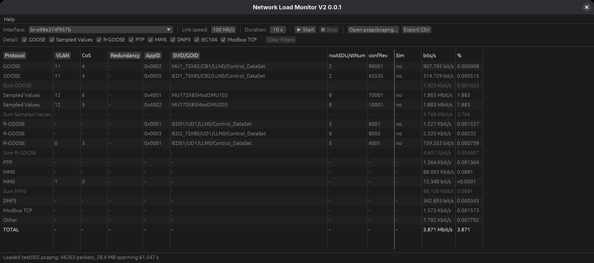
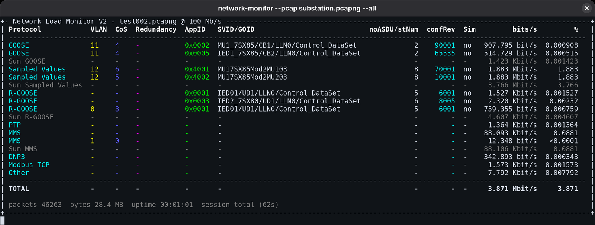
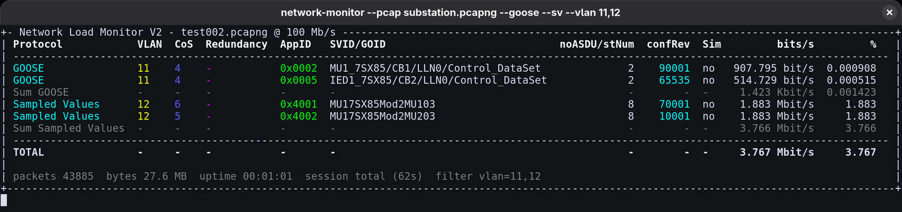
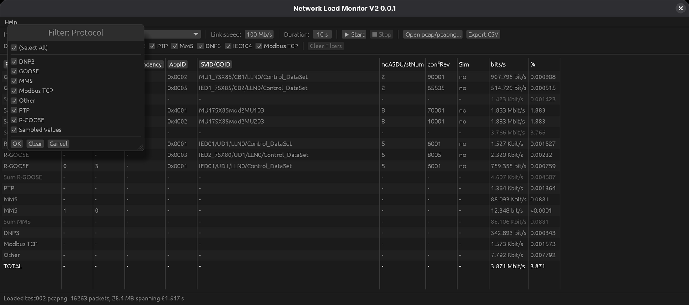

# Network Load Monitor V2

An IEC 61850 substation network analyser. It captures raw Ethernet frames on a
network interface (or reads a `.pcap`/`.pcapng` file) and classifies traffic by
protocol, VLAN and redundancy scheme (HSR/PRP), reporting throughput and
link-load percentage per protocol.

Version 0.0.1 — License: [MIT](LICENSE-MIT). Third-party components are listed
in [THIRD-PARTY-LICENSES.md](THIRD-PARTY-LICENSES.md).



Written in Rust. This is a rewrite of the Python implementation (0.0.5) and
supersedes it; see [CHANGELOG.md](CHANGELOG.md) for what changed, including
several classification fixes.

Developed by [Fabio Barros](https://github.com/floko808) with
[Claude](https://claude.com/claude-code) (Anthropic) as an AI coding
collaborator.

Two front ends share one capture/parsing engine (`nlm-core`):

- **`network-monitor`** — terminal UI, scriptable, works over SSH.
- **`network-monitor-gui`** — desktop UI built on [egui](https://github.com/emilk/egui).

Both are single self-contained executables. There is nothing to install on the
target machine: no Python, no Tk, no packet-capture library.

## Contents

- [Quick start](#quick-start)
- [Which binary should I use?](#which-binary-should-i-use)
- [System requirements](#system-requirements)
- [Using the terminal front end](#using-the-terminal-front-end)
- [Using the desktop front end](#using-the-desktop-front-end)
- [Which files can be opened](#which-files-can-be-opened)
- [Reading the table](#reading-the-table)
- [Protocols](#protocols)
- [Link speed and the load percentage](#link-speed-and-the-load-percentage)
- [Capture permissions](#capture-permissions)
- [Building from source](#building-from-source)
- [Running in a virtual machine](#running-in-a-virtual-machine)
- [Third-party licenses](#third-party-licenses)

## Quick start

**1. Get the binaries.** Either take them from `dist/` after a build, or build
them yourself — see [Building from source](#building-from-source). Nothing else
needs installing to *read a capture file*; live capture needs the permissions
described [below](#capture-permissions).

**2. Try it on a capture file first.** This needs no privileges on any
platform and is the fastest way to see what the tool does:

```bash
./network-monitor --pcap substation.pcapng --all
```

**3. Then capture live.** List the interfaces, pick one, and give it the real
link speed so the `%` column means something:

```bash
./network-monitor --list                 # what can I capture on?
sudo ./network-monitor eth0 -s 1000 -d 30
```

**4. Or use the desktop build** — `./network-monitor-gui`, then pick an
interface and press **▶ Start**, or **Open pcap/pcapng...** to load a file.

## Which binary should I use?

| | Terminal | Desktop |
|---|---|---|
| Best for | Scripting, remote/headless boxes, SSH | Point-and-click, interactive drill-down |
| Filtering | Pre-count (`--vlan`, `--appid`, ...) — filtered frames are never counted | Post-hoc column dropdowns on captured data |
| Binary | `network-monitor` / `network-monitor.exe` | `network-monitor-gui` / `network-monitor-gui.exe` |

Both read the same capture files and share one engine, so they never disagree
about what a capture contains.

## System requirements

No runtime, framework or redistributable has to be installed. What each binary
needs is listed below, measured from the binaries themselves rather than
assumed — `readelf -V` and `objdump -p` on the artifacts in `dist/`.

### Windows

| | Requirement |
|---|---|
| Architecture | x86-64 (64-bit). No 32-bit or ARM build. |
| Minimum OS | **Windows 10 / Server 2016** or newer |
| C runtime | None — the CRT is linked statically. The Visual C++ Redistributable is **not** required. |
| Graphics driver | None, for either binary, including the desktop one |
| Imported DLLs | `kernel32`, `ntdll`, `advapi32`, `iphlpapi`, `bcryptprimitives`, `api-ms-win-core-synch-l1-2-0`; the desktop build adds `gdi32`, `user32`, `shell32`, `ole32`, `imm32`, `uxtheme`, `dwmapi` — all shipped with Windows |
| For live capture | Wireshark or Npcap installed (see [Capture permissions](#capture-permissions)). Not needed to read a file. |

The PE header nominally says 6.0 (Vista), but that is the linker's default and
is not the real floor. Two imports set it: `WaitOnAddress` /
`WakeByAddressSingle` / `WakeByAddressAll` need Windows 8, and `ProcessPrng`
from `bcryptprimitives.dll` needs Windows 10. On anything older the binary
fails to load — silently, in the desktop build, which has no console to report
to.

### Linux

| | Requirement |
|---|---|
| Architecture | x86-64. No 32-bit or ARM build. |
| **glibc** | **2.34** for `network-monitor`, **2.35** for `network-monitor-gui` — the binding constraint |
| Kernel | 3.2 or newer per the ELF ABI tag; in practice far older would do, since capture uses only `AF_PACKET`/`SOCK_RAW` (Linux 2.2) and reads `/sys/class/net` |
| Shared libraries | `libc.so.6`, `libgcc_s.so.1`, and `libm.so.6` for the desktop build — nothing outside a base install |
| Graphics driver | None. The desktop build rasterises on the CPU and blits through X11 or Wayland; no OpenGL, Mesa or GPU driver is used. |
| Display | Only for the desktop build: an X11 or Wayland session. The terminal build runs headless over SSH. |
| For live capture | Root, `cap_net_raw`, or membership of the `wireshark` group (see [Capture permissions](#capture-permissions)). Not needed to read a file. |

The released Linux binaries are built inside a Debian 12 container precisely to
keep this floor low — a dynamically linked binary is only ever as portable as
the oldest glibc it was linked against, and building on a current distribution
would raise the requirement to that distribution's glibc.

| Distribution | glibc | `network-monitor` | `network-monitor-gui` |
|---|---|---|---|
| Debian 12 (bookworm) and newer | 2.36 | Yes | Yes |
| Ubuntu 22.04 LTS and newer | 2.35 | Yes | Yes |
| RHEL / Rocky / Alma 9 | 2.34 | Yes | **No** — needs 2.35 |
| RHEL / Rocky / Alma 8 | 2.28 | **No** | **No** |
| Ubuntu 20.04 LTS | 2.31 | **No** | **No** |

The desktop build's extra 0.01 comes from `hypot`/`hypotf`, which glibc gave a
new version in 2.35; the terminal build does not use them. On RHEL 9 use the
terminal front end, or build the desktop one locally.

A glibc that is too old fails at load time, not on first use — so it fails even
when merely reading a capture file, with:

```
./network-monitor: /lib/x86_64-linux-gnu/libc.so.6: version `GLIBC_2.35' not found
```

Check a target before copying a binary to it:

```bash
ldd --version | head -1                                        # what the target has
readelf -V ./network-monitor | grep -o 'GLIBC_[0-9.]*' | sort -uV | tail -1
```

If the target is older than the table allows, build on that machine — see
[Just for this machine](#just-for-this-machine). Linking against whatever glibc
is present is always sufficient.

The Windows binaries have no equivalent problem: their C runtime is linked in,
so they carry no version floor beyond the OS itself.

## Using the terminal front end

By default every protocol folds into a single **Other** row. Pass the protocol
flags to break out the ones you care about — `--all` breaks out all eight:

```bash
network-monitor --pcap substation.pcapng --all
```



The header line names the source and the link speed the `%` column is measured
against. The footer carries the session totals, and `Sum <protocol>` rows appear
whenever one protocol spans several VLAN or redundancy combinations.

### Filtering

Filter flags drop frames **before they are counted at all** — they never appear
in the table, the totals or the session summary. That is the difference from
the desktop build, whose column dropdowns filter only what is displayed.

```bash
network-monitor --pcap substation.pcapng --goose --sv --vlan 11,12
```



Note the footer: `packets 43885` against `46263` unfiltered, and the active
filter is named there so a filtered run can never be mistaken for a full one.

Comma-separated values within one flag are OR'd; different flags are AND'd
together. `--goid` and `--svid` both filter the shared SVID/GOID column and are
OR'd if both are given. `--vlan` matches any tag in a stacked (QinQ) frame, not
just the outermost.

### Command-line reference

```
network-monitor [INTERFACE] [OPTIONS]

Arguments:
  [INTERFACE]  Network interface to capture on [default: eth0]

Options:
  -d, --duration <SEC>   Stop after this many seconds; 0 = run until stopped [default: 10]
  -s, --speed <MBPS>     Link speed in Mb/s used for the load percentage
                         [default: the interface's own negotiated speed, else 100]
  -r, --refresh <SEC>    Statistics window / display refresh in seconds [default: 1]
  -l, --list             List available network interfaces and exit
      --pcap <FILE>      Read a capture file instead of capturing live
  -h, --help             Print help (see --help for the full reference)
  -V, --version          Print version

Protocol detail:
      --goose  --sv  --rgoose  --ptp  --mms  --dnp3  --iec104  --modbus
      --all                  Every supported protocol

Filters:
      --vlan <ID[,ID...]>
      --redundancy <VALUE[,VALUE...]>   hsr, prp, none, hsr-a, hsr-b, prp-a, prp-b
      --appid <HEX[,HEX...]>
      --goid <ID[,ID...]>
      --svid <ID[,ID...]>
```

`network-monitor --help` prints the full reference, including protocol
identification rules and worked examples.

### Examples

```bash
network-monitor                              # eth0, 10 s, 100 Mb/s
network-monitor eth0 -d 30                   # capture for 30 seconds
network-monitor eth1 -s 1000 -d 0            # 1 Gb/s link, run until stopped
network-monitor --list                       # show available interfaces
network-monitor eth0 --goose --sv            # break out GOOSE and SV detail
network-monitor eth0 --all                   # break out every protocol
network-monitor eth0 --vlan 11 --appid 0x4041
network-monitor eth0 --redundancy prp        # only PRP traffic, either lane
network-monitor --pcap capture.pcapng --all
```

## Using the desktop front end

Start `network-monitor-gui` — it takes no arguments; everything is set in the
window.

- Pick a **network interface**; the link speed defaults to the negotiated
  speed when the OS reports one, and stays editable.
- Set **duration** (`0` = run until stopped) and press **▶ Start** / **■ Stop**.
- Tick the **Detail** checkboxes to break protocols out of "Other". This can
  be toggled at any time, including mid-capture, and redraws immediately.
- **Open pcap/pcapng...** loads a file instead of capturing, with a progress
  dialog and a working Cancel. The file-type filter is only a convenience —
  what is actually accepted is decided by the file's own magic bytes, so a
  mislabelled file is refused rather than parsed. See
  [Which files can be opened](#which-files-can-be-opened).
- **Export CSV** writes exactly the rows on screen.

The status bar reports what was loaded, so a screenshot of a finding always
carries its own provenance:


The **Protocol / VLAN / Redundancy / AppID / SVID-GOID** column headers each
open a filter dropdown. A `▾` marks an active filter, and **Clear Filters**
resets them all:



These filter the display only and can be changed live — the underlying counts
are untouched, so clearing a filter brings every row straight back. Use the
terminal front end's `--vlan`/`--appid`/... flags instead when you want frames
excluded from the totals themselves.

## Which files can be opened

Only two formats are read: **classic pcap** and **pcapng**. Both front ends go
through the same loader, so `--pcap FILE` and the desktop **Open pcap/pcapng...**
button accept and refuse exactly the same set of files.

Acceptance is decided by the file's first four bytes, never by its name. The
file picker's type filter is a convenience for browsing; renaming a file
changes nothing about whether it loads.

| File | Result |
|---|---|
| pcap, either byte order, microsecond or nanosecond timestamps | Loaded |
| pcapng | Loaded |
| A capture named `.cap`, `.dmp`, `.txt` or anything else | Loaded — the name is not consulted |
| Anything that is not a capture, whatever it is called | `not a pcap/pcapng file (its header does not carry a capture-file magic number)` |
| A gzip-compressed capture, including `.pcap.gz` renamed to `.pcap` | Refused, with the same message |
| A capture of something other than Ethernet frames | `unsupported link type N; only Ethernet (link type 1) captures can be classified` |
| A truncated or corrupt capture | `malformed capture file: ...` |

The terminal front end prints the reason and exits non-zero; the desktop front
end shows it in a dialog and keeps whatever was already on screen.

Two of those refusals are deliberate rather than incidental:

- **Compressed captures are not transparently decompressed.** A general capture
  library will unpack a gzip wrapper with no size cap, so a small crafted file
  could expand into an effectively unbounded stream. Plain pcap and pcapng have
  no such amplification — bytes read equal bytes on disk. Decompress the file
  yourself first if you need to read one.
- **Non-Ethernet captures are refused rather than parsed.** A Linux cooked-mode
  capture parsed as Ethernet yields plausible-looking nonsense, which is worse
  than an error on a tool whose output people act on.

Frame and block lengths are also bounded (256 KiB and 16 MiB), so a corrupt or
hostile length field cannot drive a huge allocation.

## Reading the table

```
+- Network Load Monitor V2 - test002.pcapng @ 100 Mb/s ------------------------------------------+
| Protocol            VLAN  CoS  Redundancy  AppID   SVID/GOID           ...        bits/s     % |
| ---------------------------------------------------------------------------------------------- |
| GOOSE               11    4    -           0x0002  MU1_7SX85/CB1/...   ...  907.795 bit/s  0.00 |
| Sampled Values      12    6    -           0x4001  MU17SX85Mod2MU103   ...   1.883 Mbit/s  1.88 |
| Sum Sampled Values  -     -    -           -       -                   ...   3.766 Mbit/s  3.77 |
| Other               -     -    -           -       -                   ...   7.792 Kbit/s  0.01 |
| ---------------------------------------------------------------------------------------------- |
| TOTAL               -     -    -           -       -                   ...   3.871 Mbit/s  3.87 |
| packets 46263  bytes 28.4 MB  uptime 00:01:01  session total (62s)                              |
+-------------------------------------------------------------------------------------------------+
```

Columns: **Protocol**, **VLAN** (802.1Q/QinQ id), **CoS** (802.1Q PCP),
**Redundancy** (HSR-A/B or PRP-A/B), **AppID**, **SVID/GOID**,
**noASDU/stNum**, **confRev**, **Sim** (simulation flag), **bits/s**, **%** of
the configured link speed. A `Sum <protocol>` row appears when a protocol
spans multiple VLAN/redundancy combinations; **TOTAL** is the grand sum.

When a live capture ends, the table is redrawn once as a **session total**
covering the whole run, rather than leaving whatever the final window happened
to hold — which matters for bursty protocols that may have gone quiet just
before the capture stopped.

## Protocols

Protocols that can get their own detailed row (off by default):

| Protocol | Identification |
|---|---|
| GOOSE | EtherType `0x88B8` |
| Sampled Values (SV) | EtherType `0x88BA` |
| R-GOOSE | UDP multicast carrying a session PDU (IEC 61850-8-2) |
| PTP / IEEE 1588 | EtherType `0x88F7` |
| MMS | TCP port `102` + TPKT header verification (unicast, IEC 61850-8-1) |
| DNP3 | TCP/UDP port `20000` + data-link sync-byte verification (unicast) |
| IEC104 | TCP port `2404` + APCI start-byte verification — IEC 60870-5-104 (unicast) |
| Modbus TCP | TCP port `502` + MBAP header verification (unicast) |

For the four unicast protocols the well-known port is only a hint. A frame on
a matching port whose payload does not parse as that protocol's actual framing
(TPKT magic bytes, DNP3 sync bytes, IEC104 APCI start byte, or a Modbus MBAP
header) stays classified as IPv4 rather than being assumed to be that
protocol.

R-GOOSE works the same way: being sent to a multicast address is not enough,
because that range also carries mDNS, SSDP and IGMP. The payload must actually
contain a session PDU.

Unlike GOOSE/SV, those four unicast protocols are often bursty rather than
continuous — an MMS client polling by report-by-exception may exchange a
handful of packets every 10-60 s, with nothing in between. A short capture
(10 s by default) can start and stop without ever landing on a burst, in which
case its row simply won't appear that run. That's a quiet capture window, not
a detection failure. Once a burst is seen, its row stays on screen (bits/s
reset to `0.000`, labelled `idle Ns`) until the next one. For unattended
monitoring of these protocols use a longer duration, or `0` to run until
stopped, so the capture reliably spans a full cycle.

By default all eight fold into a single "Other" line — pass
`--goose`/`--sv`/`--rgoose`/`--ptp`/`--mms`/`--dnp3`/`--iec104`/`--modbus`
(CLI) or tick the matching checkbox (GUI) to break any of them into their own
rows (VLAN, CoS, AppID, SVID/GOID, noASDU/stNum, confRev, Sim).

Everything else — R-SV, GSSE, NTP, LLDP, RSTP, ARP, IPv4, IPv6 and any
unclassified traffic — is recognised internally but always aggregated into
"Other".

HSR / PRP redundancy (in-frame tag `0x892F` / RCT trailer `0x88FB`) and
VLAN/QinQ tagging are detected and shown regardless of which protocol flags
are set.

## Link speed and the load percentage

The `%` column is throughput as a fraction of the link's capacity, so it is
only as meaningful as the link speed it is measured against. Both front ends
read the interface's own negotiated speed where the OS reports one (via
`/sys/class/net` on Linux, the IP Helper API on Windows) and fall back to
100 Mb/s otherwise. The terminal build prints which value it used and whether
it was detected or assumed; the desktop build shows it in an editable field.

Override it with `-s`/`--speed`, and do so whenever the figure shown is not
the real link rate — a capture file carries no link speed at all, so `--pcap`
always assumes 100 Mb/s unless told otherwise.

The `%` column scales its precision to the value, because substation traffic
spans several orders of magnitude on the same link: a Sampled Values stream
reads `10.25`, while GOOSE and PTP background traffic on the same 100 Mb/s
link reads `0.001588` rather than rounding away to `0.00`. Traffic too small
to quantify shows `<0.0001`, which is deliberately distinct from a true zero.

## Capture permissions

**Linux** — any one of:

- run with `sudo`, or
- grant the binary the capability:
  `sudo setcap cap_net_raw+eip ./network-monitor`, or
- install `wireshark-common` and add your user to the **`wireshark`** group
  (`sudo usermod -aG wireshark $USER`, then log out and back in) — the tool
  falls back to `dumpcap` automatically when it cannot open a raw socket.

**Windows** — capturing needs a packet-capture driver:

1. Install [Wireshark](https://www.wireshark.org/), which bundles **Npcap**.
2. Then either run the `.exe` as Administrator, **or** re-run the Npcap
   installer (Control Panel → Programs → Npcap → Change) and uncheck
   **"Restrict Npcap driver's access to Administrators only"** to capture
   without elevation.

Reading a `.pcap`/`.pcapng` file needs no special permissions on either
platform.

## Building from source

### Prerequisites

| | Needed for | Install |
|---|---|---|
| Rust 1.82 or newer | everything | [rustup.rs](https://rustup.rs) |
| `cargo-xwin` | cross-compiling to Windows from Linux | `cargo install cargo-xwin` |
| `x86_64-pc-windows-msvc` target | same | `rustup target add x86_64-pc-windows-msvc` |
| `objdump` (binutils) | the Windows portability check | your distribution's `binutils` |
| `wine` | optionally smoke-testing the `.exe`s on Linux | your distribution's `wine` |

Nothing here needs root, and there are no C libraries or `-dev` packages to
install: all protocol parsing and packet capture is implemented in this
project.

### Just for this machine

If you only want a binary for the computer you are sitting at — which is also
the fix for the [glibc floor](#linux) on an older distribution — plain cargo is
enough. Only Rust is needed; ignore the rest of the prerequisites table.

```bash
git clone https://github.com/floko808/network-load-monitor-v2
cd network-load-monitor-v2
cargo build --release
```

The two executables land in `target/release/`:

```bash
./target/release/network-monitor --pcap substation.pcapng --all
./target/release/network-monitor-gui
```

Building on the target machine links against whatever glibc it has, so the
result runs there regardless of how old the distribution is.

### One command

```bash
./build.sh            # test, then build Linux + Windows into dist/
./build.sh linux      # Linux only
./build.sh windows    # Windows only
./build.sh test       # tests only
```

`build.sh` is the supported path because it does four things a bare
`cargo build` does not:

1. Runs the full test suite first.
2. **Asserts the Windows binaries are self-contained** — it fails the build if
   either `.exe` imports OpenGL, Direct3D, Vulkan or the Visual C++ runtime.
   That check is what makes "copy one file across and run it" true, so a new
   dependency cannot quietly break it. (It is skipped with a warning if
   `objdump` is missing.)
3. Smoke-tests what it built — `--version` and `--list` on Linux, and the
   `.exe`s under `wine` when available — so a broken link fails here rather
   than on a substation laptop.
4. **Copies the license files in**, so a binary carries its terms with it. A
   distributed executable leaves this repository behind, and both this
   project's license and the attribution notices of the crates linked into it
   have to travel alongside — the build fails rather than packaging without
   them.
5. Writes `dist/SHA256SUMS`, covering the license files as well as the
   binaries.

Artifacts land in `dist/`:

```
dist/linux/network-monitor          dist/windows/network-monitor.exe
dist/linux/network-monitor-gui      dist/windows/network-monitor-gui.exe
dist/LICENSE-MIT                    dist/LICENSE-APACHE
dist/THIRD-PARTY-LICENSES.md        dist/SHA256SUMS
```

`dist/` is therefore a complete, redistributable drop: copy the whole directory
(or one platform's subdirectory plus the three license files) and the
attribution requirements are met.

Verify a copy after transferring it:

```bash
cd dist && sha256sum -c SHA256SUMS
```

### Reproducing the released Linux binaries

`./build.sh linux` links against the glibc of whatever machine you run it on,
which is right for local use but would raise the floor documented under
[System requirements](#linux) for anyone downloading the result. The published
binaries are therefore built inside a Debian 12 container:

```bash
docker run --rm -v "$PWD":/src -w /src -e CARGO_TARGET_DIR=/tmp/tgt \
  rust:1-bookworm \
  cargo build --release --workspace
```

Then copy `/tmp/tgt/release/network-monitor{,-gui}` into `dist/linux/` and run
`./build.sh windows` to produce the `.exe`s, verify the portability gate, add
the license files and regenerate `dist/SHA256SUMS` over the whole set.

### Cross-compiling to Windows

Windows binaries are cross-compiled from Linux with
[cargo-xwin](https://github.com/rust-cross/cargo-xwin), which needs no root and
no distribution packages:

```bash
cargo install cargo-xwin
rustup target add x86_64-pc-windows-msvc
./build.sh windows
```

On first use cargo-xwin downloads the Microsoft CRT and Windows SDK
headers/import libraries into the cargo cache; subsequent builds are offline.
The MSVC target is used rather than `x86_64-pc-windows-gnu` because it needs no
mingw toolchain installed system-wide.

The C runtime is linked statically (see `.cargo/config.toml`). Without that the
binaries would import `VCRUNTIME140.dll` and the `api-ms-win-crt-*` stubs,
which ship with the Visual C++ Redistributable rather than with Windows — on a
machine that has never had it installed the executable simply fails to start,
and a GUI-subsystem binary does so with no visible error at all.

Building natively **on** Windows works the same way with `cargo build --release`.

### Working on the code

```bash
cargo test --workspace                 # the engine's real gate
cargo clippy --workspace --all-targets
cargo run -p nlm-cli -- --pcap capture.pcapng --all
cargo run -p nlm-gui
```

The workspace is one engine crate and two thin front ends:

```
crates/nlm-core   parsing, filtering, capture, statistics, table layout
crates/nlm-cli    binary: network-monitor
crates/nlm-gui    binary: network-monitor-gui
```

[SKILL.md](SKILL.md) is a full from-scratch specification of the engine —
every byte-level parsing rule, both APDU walkers and the capture backends.

### If a build fails

| Message | Fix |
|---|---|
| `cargo-xwin not found` | `cargo install cargo-xwin` |
| `Rust target missing` | `rustup target add x86_64-pc-windows-msvc` |
| First Windows build stalls on the network | cargo-xwin is fetching the CRT and SDK; one-off, then offline |
| `Windows binaries are not self-contained` | A dependency pulled in a graphics or C-runtime import — the offending DLLs are listed above the error |
| `objdump not found; skipping portability check` | Install binutils; until then that safety check is off |

## Running in a virtual machine

Both builds run in a VM with no graphics driver of any kind, including
Hyper-V, and neither needs anything installed alongside it.

The desktop build rasterises its interface on the CPU and blits it with GDI
(Windows) or X11/Wayland (Linux). It links **no** OpenGL, Direct3D, Vulkan or
C-runtime library — the only DLLs it imports are core Windows components
present on every install. `build.sh` asserts this on every Windows build, so a
dependency cannot creep back in unnoticed.

That is a deliberate trade. A GPU-accelerated UI cannot start on a typical
Hyper-V guest: there is no OpenGL beyond 1.1, and no Direct3D adapter to fall
back on either. The alternative — shipping a software OpenGL library — would
have meant 59 MB of DLLs sitting next to the executable, which is no longer a
portable binary. Drawing the interface ourselves keeps each front end a single
file that runs anywhere.

## Third-party licenses

All protocol parsing, both capture-file readers and the raw-socket backend are
implemented directly in this project, so there is no packet-capture library
dependency and no license inherited from one. `dumpcap` is executed as a
separate process when used, never linked.

| Crate | License | Used for |
|---|---|---|
| [clap](https://github.com/clap-rs/clap) | MIT OR Apache-2.0 | CLI argument parsing |
| [crossterm](https://github.com/crossterm-rs/crossterm) | MIT | Terminal control and colour |
| [ctrlc](https://github.com/Detegr/rust-ctrlc) | MIT OR Apache-2.0 | Signal handling |
| [egui](https://github.com/emilk/egui) | MIT OR Apache-2.0 | Desktop widgets |
| [egui_extras](https://github.com/emilk/egui) | MIT OR Apache-2.0 | Table widget |
| [egui_software_backend](https://github.com/DGriffin91/egui_software_backend) | MIT OR Apache-2.0 | CPU rasteriser and window, so the desktop build needs no GPU |
| [rfd](https://github.com/PolyMeilex/rfd) | MIT | Native file dialogs |
| [libc](https://github.com/rust-lang/libc) | MIT OR Apache-2.0 | Raw socket syscalls (Unix) |
| [winreg](https://github.com/gentoo90/winreg-rs) | MIT | Locating Wireshark (Windows) |

This project's own code is licensed [MIT](LICENSE-MIT). Every dependency,
direct and transitive, is permissively licensed and compatible with it; nothing
copyleft is linked into either binary.

A few dependencies carry attribution terms of their own rather than MIT's —
`winit` is Apache-2.0 only, the embedded default fonts add OFL-1.1 and the
Ubuntu Font Licence, and the Linux build reaches some BSD, ISC and Unicode-3.0
crates. This is why `LICENSE-APACHE` is still in the repository and in `dist/`
even though the project is MIT: Apache-2.0 requires that its text reach anyone
who receives the binary, so it ships as a third-party notice rather than as a
license option for this code.
[THIRD-PARTY-LICENSES.md](THIRD-PARTY-LICENSES.md) lists all 239 dependencies
with versions and explains what each exception requires. `./build.sh` copies
all of it into `dist/`, so distributing that directory is already compliant.
